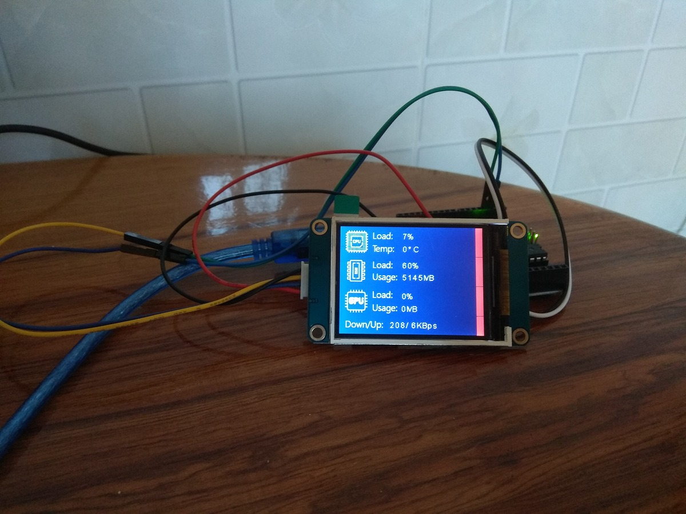

# Night's Watch
> Night gathers, and now my watch begins. It shall not end until my death. I shall take no wife, hold no lands, father no children. I shall wear no crowns and win no glory. I shall live and die at my post. I am the sword in the darkness. I am the watcher on the walls. I am the shield that guards the realms of men. I pledge my life and honor to the Night's Watch, for this night and all the nights to come. 
The Night's Watch oath 

Night's Watch is your system monitor and notifier.  
[...]

## Setup
[...]

## Development
[...]

## Contributing
All contributions are welcome.

## License
Night's Watch is licensed under the MIT License. See [LICENSE](https://github.com/lnquy/nights-watch/blob/master/LICENSE) for the full license text.